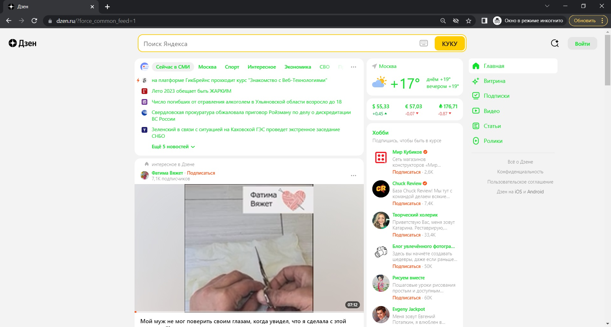

## Определите, на каком протоколе работает сайт:

Протокол HTTPS (Hypertext Transport Protocol Secure) – это протокол, который обеспечивает целостность и конфиденциальность данных при их передаче между сайтом и устройством пользователя

---
## Проанализируйте структуру страницы сайта:
1. шапка (header)
2. Зона контента (content)
3. Зона виджетов
4. Подвал (footer)

---
## Внесите не менее 10 изменений на страницу с помощью инструмента разработчика и представьте скриншоты было/стало.
БЫЛО:

СТАЛО:

---
## Задание по желанию необязательное - Создайте прототип низкой детализации (дополнительное задание, если на семинаре дошли до задания №8).

